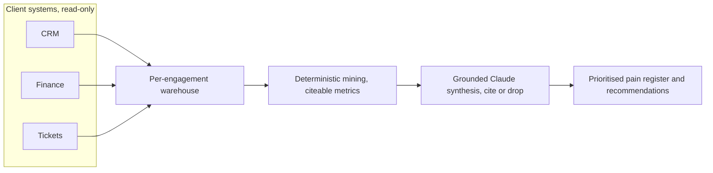

<div align="center">

<picture>
  <source media="(prefers-color-scheme: dark)" srcset="brand/egnta-wordmark-dark.svg">
  
</picture>

### Read-only client-discovery accelerator

Maps how a business actually runs, finds where it hurts, and never writes a thing.

[](https://github.com/venode-labs/EGNTA/actions/workflows/discovery-ci.yml)
&nbsp;
&nbsp;
&nbsp;
&nbsp;

</div>

---

## Contents

[What it is](#what-it-is) · [Why EGNTA](#why-egnta) · [Architecture](#architecture) · [Quickstart](#quickstart) · [Deploy anywhere](#deploy-anywhere) · [Results](#results) · [Security](#security) · [Roadmap](#roadmap) · [Docs](#docs)

## What it is

EGNTA is deployed into a client business, reads how the business actually runs across
its systems, and returns a prioritised pain register plus AI and process
recommendations. It is read-only by construction: it never writes to or changes any
client system. It serves any business as a configurable engine, not a per-client
rebuild.

The discovery sprint that used to take a consultant a fortnight of interviews, run
deterministically and grounded in evidence, in an afternoon.

## Why EGNTA

| | |
|---|---|
| **Read-only by design** | No write capability in the code. Reads through client-provisioned read-scoped credentials. Every read is logged. |
| **Grounded, no hallucination** | Every finding cites a resolvable warehouse fact or it is dropped at the gate. |
| **Deterministic core** | A clean-room miner produces the evidence; the model reasons over it, never over a live system. Same input, same answer. |
| **Any business** | A configurable engine, customisation by configuration, not bespoke code per client. |
| **Runs anywhere** | Stdlib engine, per-engagement SQLite, a single container. Linux, macOS, Windows, any cloud. |
| **Cheap** | A discovery run is a couple of model calls, cents, not a multi-day engagement. |

## Architecture

The load-bearing inversion: the model never touches a live client credential or
system. It reasons over a warehouse of already-extracted, already-redacted,
already-mined facts.



Read-only is defence in depth: a SELECT-only warehouse role and a read-only tool
guard are enforced today; client OAuth scopes, an egress proxy and per-engagement
isolation are documented stubs. See [`docs/ARCHITECTURE.md`](docs/ARCHITECTURE.md).

## Quickstart

Stdlib-only engine. Needs Python 3.12+.

```bash
python -m accelerator version
python -m accelerator bench --json            # deterministic, no key, no network
ANTHROPIC_API_KEY=sk-ant-... python -m accelerator bench --real-llm
```

## Deploy anywhere

```bash
docker build -t egnta . && docker run --rm egnta version
docker compose run --rm egnta bench --json
```

Runs on Linux, macOS and Windows, and as a container on any cloud. The Anthropic key
comes from `ANTHROPIC_API_KEY` at runtime and is never baked into the image. Full
guide: [`docs/DEPLOY.md`](docs/DEPLOY.md).

## Results

The improvement claim is treated as a measurement, pre-registered, not a slogan. On
the graded synthetic corpus EGNTA scores gated F1 1.0 against a fair naive single-LLM
baseline at 0.889. Read the honest reading in [`docs/EVAL-METHOD.md`](docs/EVAL-METHOD.md):
the headline ratio is flattered by a strong baseline, the genuine, repeatable edge is
precision, grounding, determinism and cost, and generalisation to defect classes the
miner cannot yet detect is stated as open, not proven. No fabricated numbers.

## Security

- Read-only at the database (`PRAGMA query_only`) and at the tool layer (deny any non-GET, non-SELECT).
- Ingest scrubber strips credentials and personal data before anything reaches the warehouse; the benchmark plants a secret and asserts zero leak on every run.
- Grounding gate drops any finding without a resolvable citation, so a prompt injection cannot smuggle a fabricated finding through.
- Per-engagement warehouse isolation; raw transcripts never committed.

## Roadmap

- [x] Warehouse, clean-room miner, read-only enforcement, graded benchmark, CI
- [x] Grounded Claude synthesis and the real-LLM benchmark
- [x] Multi-bottleneck detection, cross-OS and container deployability
- [ ] Live read-only connectors (Nango/Merge) and Postgres backend
- [ ] Held-out generalisation corpus (segregation-of-duties, cross-source)
- [ ] Model-based name and address PII pass

## Docs

- [`docs/ARCHITECTURE.md`](docs/ARCHITECTURE.md) the warehouse-first design and read-only enforcement
- [`docs/EVAL-METHOD.md`](docs/EVAL-METHOD.md) the pre-registered metric and the honest results
- [`docs/DEPLOY.md`](docs/DEPLOY.md) running on any OS and any cloud
- [`docs/DECISIONS.md`](docs/DECISIONS.md) the decision log

The `accelerator/` and `bench/` packages are the product. The `observer/` and training
files are a deferred earlier track kept in the tree.

<div align="center">

Built by [Venode Labs](https://venode.ai). © Venode Labs.

</div>
