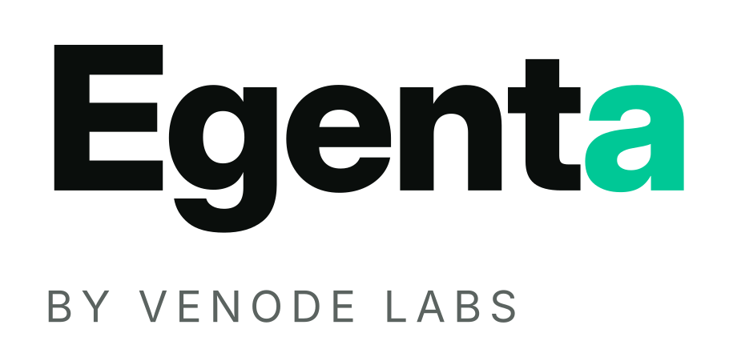

<picture>
  <source media="(prefers-color-scheme: dark)" srcset="brand/egenta-wordmark-dark.svg">
  
</picture>

# Egenta

Read-only client-discovery accelerator by Venode Labs. Deployed into a client
business, it maps how the business actually runs and returns a prioritised pain
register plus AI and process recommendations. It never writes to or changes any
client system, and serves any business as a configurable engine, not a per-client
rebuild.

## How it works

Deterministic read-only connectors normalise each source into a canonical event log
in a per-engagement warehouse. A deterministic mining pass writes citeable metrics.
Claude reasoners then synthesise a grounded pain register over the warehouse, every
finding citing a resolvable fact or it is dropped. The model never touches a live
client credential or system. See `docs/ARCHITECTURE.md`.

## Quickstart

Stdlib-only engine, runs on Linux, macOS and Windows, and as a container on any cloud.

```
python -m accelerator version
python -m accelerator bench --json                 # deterministic, no key, no network
ANTHROPIC_API_KEY=sk-ant-... python -m accelerator bench --real-llm

docker build -t egenta . && docker run --rm egenta version
```

The Anthropic key is read from `ANTHROPIC_API_KEY` (or the local `pass` vault), never
from source. Full guide in `docs/DEPLOY.md`.

## Status

Iterations 1-4 shipped, CI green on Linux, macOS and Windows plus a container build.
The graded benchmark and its honest verdict (what is and is not substantiated, and
where the headline metric is flattered) live in `docs/EVAL-METHOD.md`. Decisions are
logged in `docs/DECISIONS.md`. Read-only enforcement is two enforced layers today
plus documented stubs; live connectors and a Postgres backend are the next increments.

## Docs

- `docs/ARCHITECTURE.md` the warehouse-first design and read-only enforcement
- `docs/EVAL-METHOD.md` the pre-registered metric and the honest results
- `docs/DEPLOY.md` running on any OS and any cloud
- `docs/DECISIONS.md` the decision log

The `observer/` and training files are a deferred earlier track kept in the tree; the
discovery accelerator is `accelerator/` and `bench/`.
