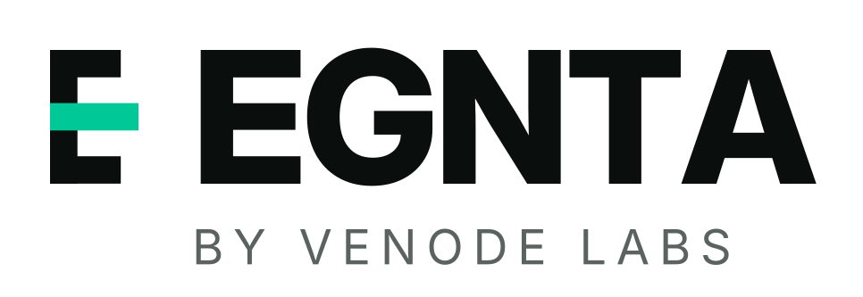
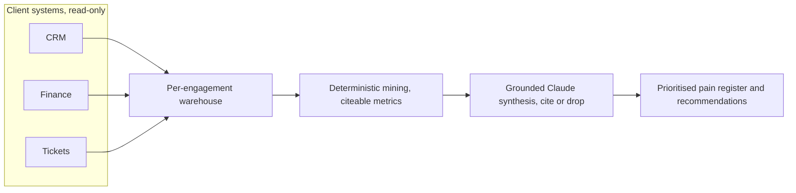

<div align="center">

<picture>
  <source media="(prefers-color-scheme: dark)" srcset="brand/egnta-wordmark-dark.svg">
  
</picture>

### Read-only client-discovery accelerator

Maps how a business actually runs, finds where it hurts, and never writes a thing.

[](https://github.com/venode-labs/EGNTA/actions/workflows/discovery-ci.yml)
&nbsp;
&nbsp;
&nbsp;
&nbsp;

</div>

---

## Contents

[What it is](#what-it-is) · [Why EGNTA](#why-egnta) · [Architecture](#architecture) · [Quickstart](#quickstart) · [Deploy anywhere](#deploy-anywhere) · [Results](#results) · [Security](#security) · [Roadmap](#roadmap) · [Docs](#docs)

## What it is

EGNTA reads how a business actually runs across its systems and returns a prioritised
pain register plus AI and process recommendations. It is read-only by construction: it
never writes to or changes any client system.

It ships as a vertical-configurable engine, and the first vertical is fire, construction
and service trades (fire protection, electrical, plumbing, HVAC, facilities). The trades
pack knows the domain: unbilled job completion, defect-to-rectification stall, overdue
AS 1851 compliance, approval gaps, repeat-visit rework, dispatch bottlenecks, the same
person quoting and approving a job, and money billed in finance with no matching job in
the field-service system. That last one is cross-source: it joins finance and operations,
which the single-system process miners do not do. Shipping the semantic layer with the
product is what lets it run on a real field-service export without a bespoke modelling
phase first.

It is built for the operator or the consultant who runs the discovery: it speeds the
evidence-gathering and the first cut of findings, it does not replace the human judgement
on what to do about them.

## Why EGNTA

| | |
|---|---|
| **Read-only by design** | No write capability in the code. Reads through client-provisioned read-scoped credentials. Every read is logged. |
| **Grounded, no hallucination** | Every finding cites a resolvable warehouse fact or it is dropped at the gate. |
| **Deterministic core** | A clean-room miner produces the evidence; the model reasons over it, never over a live system. Same input, same answer. |
| **Vertical packs** | A domain semantic layer ships with the engine. Fire and service trades first; the pack is a module, not a rebuild per client. |
| **Real connector** | Reads a ServiceM8, simPRO or Uptick CSV or JSON export into the canonical event log. Read-only by nature; it never writes the source. |
| **Runs anywhere** | Stdlib engine, per-engagement SQLite, a single container. Linux, macOS, Windows, any cloud. |
| **Cheap** | A discovery run is a couple of model calls, cents, not a multi-day engagement. |

## Architecture

The load-bearing inversion: the model never touches a live client credential or
system. It reasons over a warehouse of already-extracted, already-redacted,
already-mined facts.



Read-only is defence in depth: a SELECT-only warehouse role, a read-only tool guard,
and the egress allowlist policy are enforced today; client OAuth scopes and
per-engagement network isolation are documented stubs that raise rather than pretend.
See [`docs/ARCHITECTURE.md`](docs/ARCHITECTURE.md).

## Quickstart

Stdlib-only engine. Needs Python 3.12+.

```bash
python -m accelerator version
python -m accelerator bench --vertical trades --json   # deterministic, no key, no network
python -m accelerator report --vertical trades         # the plain-language pain register
python -m accelerator report --csv jobs-export.csv     # run it on a real field-service export
ANTHROPIC_API_KEY=sk-ant-... python -m accelerator bench --vertical trades --real-llm
```

## Deploy anywhere

```bash
docker build -t egnta . && docker run --rm egnta version
docker compose run --rm egnta bench --json
```

Runs on Linux, macOS and Windows, and as a container on any cloud. The Anthropic key
comes from `ANTHROPIC_API_KEY` at runtime and is never baked into the image. Full
guide: [`docs/DEPLOY.md`](docs/DEPLOY.md).

## Results

The improvement claim is treated as a measurement, pre-registered, not a slogan. The
trades corpus plants ten labelled defects, one of them, a duplicate invoice across two
finance entities, held out as a class no deterministic detector can compute. On that
corpus the trades miner scores gated precision 1.0, recall 0.9 (it catches all nine it
has a detector for and honestly misses the held-out one), F1 0.947, zero hallucination,
zero secret leak. The held-out defect is the point: detection-F1 sits below ceiling on
purpose, so the number is not a graded-your-own-homework 1.0. Each detector added rotates
in a harder held-out, so one class is always undetectable.

The deterministic core is also validated off the synthetic corpus: `bench/validate_real_log.py`
runs the connector and the clean-room miner over a real public process log (the receipt
phase of a Dutch environmental-permit process, 1434 cases, 27 activities) and produces
grounded control-gap and bottleneck findings in under a second. Real data, not just
generated. Read the method in [`docs/EVAL-METHOD.md`](docs/EVAL-METHOD.md). The repeatable
edge is precision, grounding, determinism and cost; recovering classes the miner has no
detector for is open work, not a claim.

## Security

- Read-only at the database (`PRAGMA query_only`) and at the tool layer (deny any non-GET, non-SELECT).
- Ingest scrubber strips credentials and personal data before anything reaches the warehouse; the benchmark plants a secret and asserts zero leak on every run.
- Grounding gate drops any finding without a resolvable citation, so a prompt injection cannot smuggle a fabricated finding through.
- Per-engagement warehouse isolation; raw transcripts never committed.

## Roadmap

- [x] Warehouse, clean-room miner, read-only enforcement, graded benchmark, CI
- [x] Grounded Claude synthesis and the real-LLM benchmark
- [x] Trades vertical pack (nine domain detectors incl cross-source) and a rotating held-out
- [x] Read-only CSV/JSON export connector + core validated on a real public log
- [x] Plain-language pain-register report; egress allowlist enforced (3 of 5 read-only layers)
- [ ] Live read-only API connector to a field-service platform (needs client OAuth)
- [ ] Entity-resolution detector for the duplicate-invoice held-out class
- [ ] Postgres backend, OAuth-scope enforcement, model-based name/address PII pass

## Docs

- [`docs/ARCHITECTURE.md`](docs/ARCHITECTURE.md) the warehouse-first design and read-only enforcement
- [`docs/EVAL-METHOD.md`](docs/EVAL-METHOD.md) the pre-registered metric and the honest results
- [`docs/DEPLOY.md`](docs/DEPLOY.md) running on any OS and any cloud
- [`docs/DECISIONS.md`](docs/DECISIONS.md) the decision log

The `accelerator/` and `bench/` packages are the product. The `observer/` and training
files are a deferred earlier track kept in the tree.

<div align="center">

Built by [Venode Labs](https://venode.ai). © Venode Labs.

</div>
